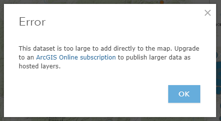
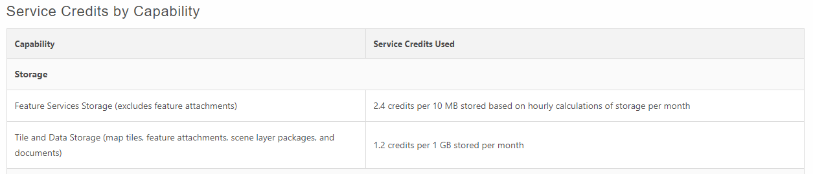

# Learn ArcGIS Story Maps / Create an ArcGIS Online Account #

In order to create a Story Map, you must first have an ArcGIS Online account.  ArcGIS Online is a cloud-based mapping platform.  With this
platform, you and members of your organization can make and share maps without having to use a desktop version of ArcGIS.  You can then also 
access these mapping projects from your browser, tablet, smartphone or desktop. 
There are two types of accounts you can sign up for:  a personal ArcGIS Public Account or an ArcGIS Organizational Account.  These are discussed
below.

## ArcGIS Public Account ##

The ArcGIS Public Account (sign up [here](https://www.arcgis.com/home/signin.html)) is a free, personal account with limited usage and
capabilities that is meant for non-commercial use only.  Not all of the features that are available with an organizational account are
available with the public account.  However, it is still possible to make a Story Map with a public account and this documentation will discuss
what can be created with a public account and where the paid, organizational account is necessary. 

### Limitations of the Public Account ###

There are some limitations with the public account.  These are described below and will also be re-stated where applicable when describing
 the steps to build a Story Map.

* The number of rows of data that are possible to add when adding a layer directly from the web is limited. For example, OWF attempted to add a 
CSV file directly from the Colorado Information Marketplace's website.  The dataset contained 1,100 records.  The following error occurred:
 

For many map layers, this may not be an issue, but for line layers such as those for streams, it is very easy to have files that contain over
1,000 records.  One work-around is to create subsets of the original map layer, which are then added to the mapping project, but this may create
 additional processing steps that could be considered too time consuming.

* The number of rows of data that are possible to add when adding a layer from a file on your computer is limited in the same way as listed
above.

* Analysis tools are not available with the public account.  This includes tools for summarizing data, finding locations based on certain
 criteria, analyzing patterns, extracting data, overlaying data and merging data.  For example, linking a spatial layer of Colorado counties to 
 a separate table of county population data is not possible.

* Your maps and projects cannot be made private.

* **Need to add more here**

--------------------

## ArcGIS Organizational Account ##

To be able to fully utilize all of ArcGIS Online's features, you will need to register for an Organizational Account, which is an
annual subscription.  Within your organization you can purchase the exact number of users that will use the account.  Users are classified as
either a Contributor or a Viewer.  A Viewer can basically view maps and projects but cannot create new maps or edit existing ones.  The price
 for a Viewer is $9/month.  A Contributor can create new maps, edit existing ones, perform spatial analyses, add new content, etc.  The price 
 for a Contributor is $42/month.  Anyone looking to create a Story Map will therefore need to be registered as a Contributor.
 
**If you have already purchased ArcGIS Desktop, then this should have come with an ArcGIS Online subscription for one user.**  See more information
[here](http://www.esri.com/esri-news/arcnews/winter1314articles/arcgis-for-desktop-now-includes-arcgis-online-subscription).  Adding another member 
requires paying the fee for either a Viewer or a Contributor.
 
There is special program pricing for educational institutions and non-profits.  However, you must apply and be approved for an account, and 
the cost for this style of account is not listed.
 
Each Contributor subscription comes with 500 "service credits" per year.  Service credits are needed for storage, analytics, demographics and
lifestyle maps.  The service credits used for storage are shown below.

<a href="../create-account-images/servicecredits.png">See also the full-size image.</a>

See [Service Credits Overview](http://www.arcgis.com/features/plans/credits.html) for more information.  If you received a free subscription 
because you purchased ArcGIS Desktop, then that subscription should come with 100 service credits.  Additional service credits can be
 purchased from the Esri store.
    
--------------------

## Next Steps ##

After setting up either a free, public account or registering for an organizational account, the next step is to create your first map.
