# Create a Basic Map / Add Layers #

Layers are the real content of the map.  Layers can consist of points (cities, parks, sampling locations), 
lines (rivers, roads) or polygons (county boundaries, land parcels).  You can add one layer or multiple 
layers to a map.  You can add layers of the following types:

* ArcGIS Server service (elevation, feature, map image, imagery and tile layers) (URL)
* Comma-separated values (CSV) files (.csv)
* GeoJSON (.json or .geojson)
* GeoRSS web feed (URL)
* GPS exchange format file (.gpx)
* Keyhole markup language (KML) file (.kml, .kmz)
* Open Geospatial Consortium (OGC) Web Feature Service (WFS) (URL)
* Open Geospatial Consortium (OGC) Web Map Service (WMS) (URL)
* Open Geospatial Consortium (OGC) Web Map Tile Service (WMTS) (URL)
* Shapefile (.zip)
* Text file (.txt)
* Tile layer (URL)
* Map notes (created in Map Viewer)
* Route (created in Map Viewer)
------------------

There are several ways to add layers to a map:

* Search for layers
* Browse Living Atlas layers
* Purchase layers through ArcGIS Marketplace
* Add layers from the web
* Add layers from files

We will examine adding layers from the web and adding layers from files.

The remainder of this page includes the following sections:

* [Add Layers From a File](#add-layers-from-a-file)
* [Add Layers From the Web](#add-layers-from-the-web)
* [Other Methods for Adding Layers](#other-methods-for-adding-layers)

-----------------
## Add Layers from a File ##
OWF commonly uses CSV and GeoJSON formats when working with data, so we will describe how to add layers in those formats. 
Other file formats that can be used include:  .txt, .gpx, .json, and shapefiles (compressed into a .zip file).

### Add a CSV Layer from a File ###
OWF is working with the [South Platte Basin Roundtable](http://southplattebasin.com/) to produce a map of Identified Projects 
and Processes (IPPs), which are projects that will help the basin meet all of its future water needs.  OWF received an Excel 
file of all of the projects in both the South Platte and Metro basins, with project locations in decimal degrees.  OWF converted 
the file to CSV format, which can now be loaded into the map.

1.  Click the Add button, then select Add Layer from File:

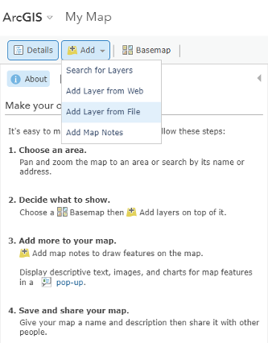

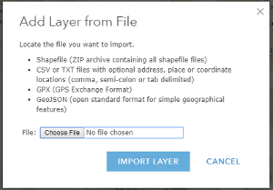  
2.  Choose the file of interest:

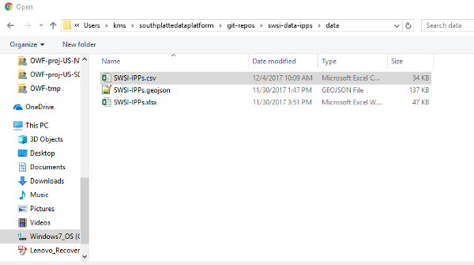  
3.  Click on Import Layer.  The layer will load into Map Viewer and looks like the following:

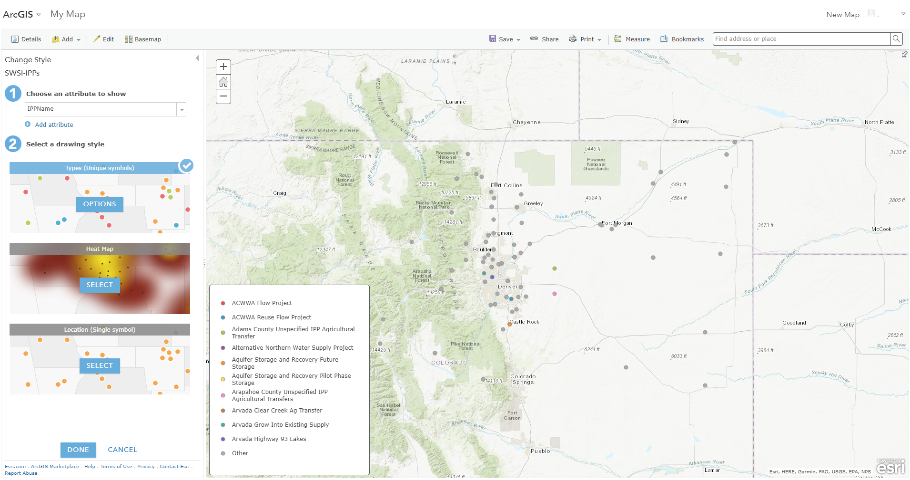  

We have now added a point layer of data to our map.  We will change the style of the layer in the next section, but first 
we will add more layers.  For now, we will click Done to keep the layer as-is. 

**Note:** You can also add a CSV file that doesn't contain location information to Map Viewer.  It will be loaded as a table rather 
than a layer.  This is useful if you want to join non-spatial data from the table to a spatial layer, but you **cannot** join 
features in this way if you have a public account.  You must have an organizational account.

---------------------------------------
### Add a GeoJSON Layer from a File ###
We can also add layers in .geojson format from a file.  For this example, we will add a polygon layer of counties in Colorado. 
Following the same steps as above, we'll add a layer called Colorado-Counties-WGS84.geojson.  When added to the map, it looks like 
the following:

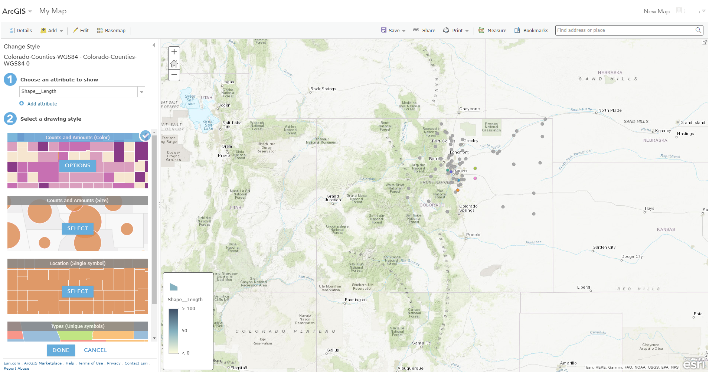  

To see the county boundaries, look at the left-hand side of the image.  Under "Choose an attribute to show" (1) we'll choose 
"Show location only".  The county layer is now visible and is symbolized with a single color.

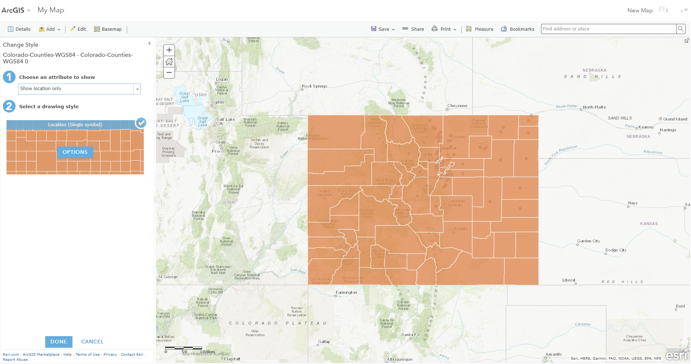  

Counties can be color-coded based on an attribute of the data, but for now, we'll leave this layer as a single color.   

---------------------------------------
## Add Layers from the Web ##
Data layers can also be added to a map from the web through a URL.  The following file formats can be loaded to a map from the 
web:  ArcGIS Server web service; OGC WFS, WMS and WMTS web services; Tile layer; KML file; GeoRSS file; and CSV file.  Note that 
you currently cannot load GeoJSON files from the web.

Let's add a CSV file from the web.  Note that with adding CSV files, you are limited to adding *point* layers because you cannot 
represent line or polygon features in CSV format.  This example will also illustrate how it is possible to add CSV files from a 
[GitHub](https://github.com/) repository.  Also note that since this file is available on the web, you can directly follow along 
and add this layer into your own map.

1.  Navigate to the Open Water Foundation's GitHub repository for [Colorado municipalities](https://github.com/OpenWaterFoundation/owf-data-co-municipalities). 
You should see the following:

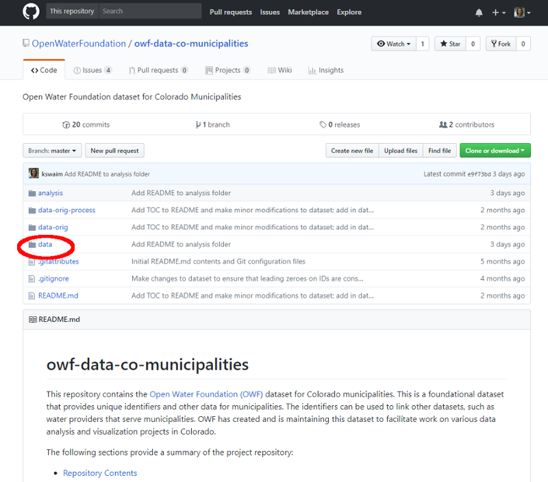  
2.  Click on the `data` folder.  Then click on `Colorado-Municipalities.csv`.  You should see an image similar to that below.

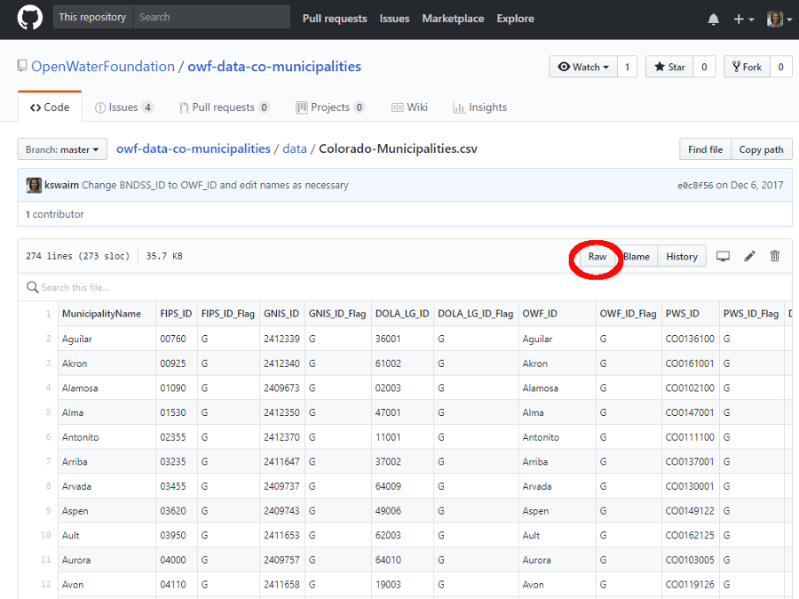    
3.  Click on the "Raw" button (highlighted in image above).  The page should now look like the following:

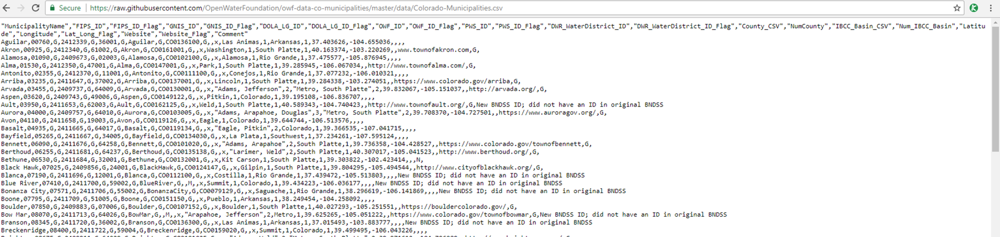  
4.  Copy the URL address in the address bar.  Notice that the address ends in ".csv".  
5.  Navigate back to Map Viewer.  Click the Add button, then select Add Layer from Web:

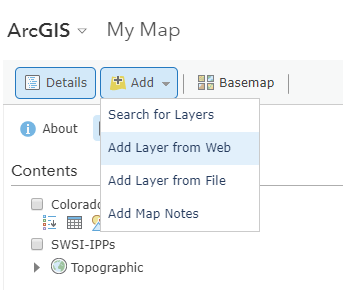  
6.  Under "What type of data are you referencing?" choose "A CSV File".  Then paste in the URL that you previously copied.

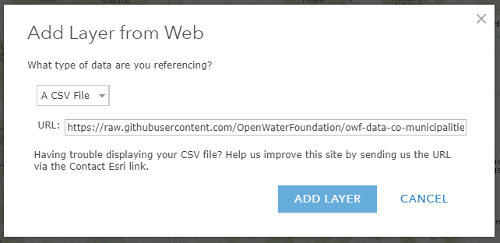  
Click on "Add Layer".  Your map should look like the following:

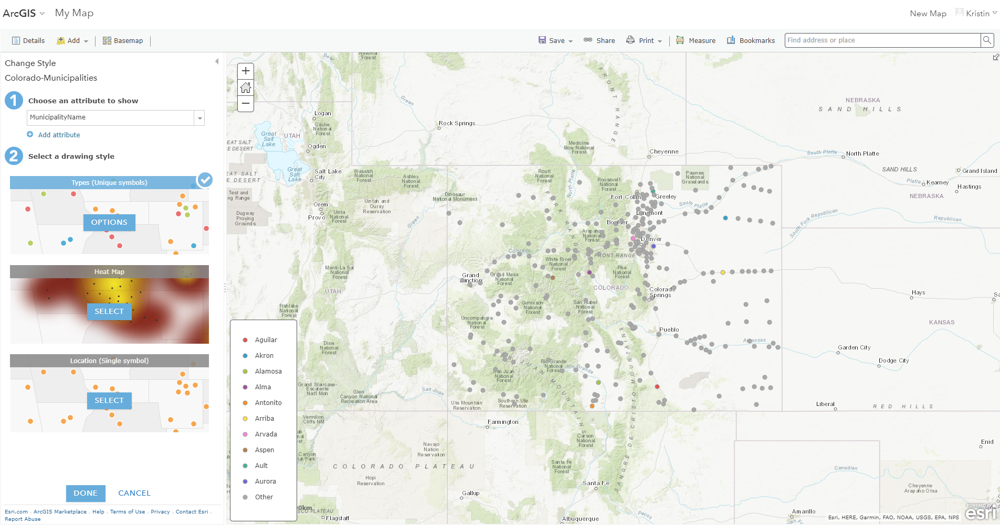  
On the left-hand side of the map, under "Choose an attribute to show" (1) choose 
"Show location only".  The point layer is symbolized with a single color.  Then click "Done".  You can now see all of 
Colorado's municipalities symbolized on the map.

**TO DO:  Try adding a KML polygon file from CIM**

------------------
## Other Methods for Adding Layers ##
### Search for Layers ###
To be completed.

### Browse Living Atlas Layers ###
To be completed.

### Purchase Layers through ArcGIS Marketplace ###
OWF is not investigating this option because we generally try to use data that are freely available.

------------------
## Next Steps ##

The next step is to change the style of the map.  We will change the look of the IPP point layer that 
we added in from a file.