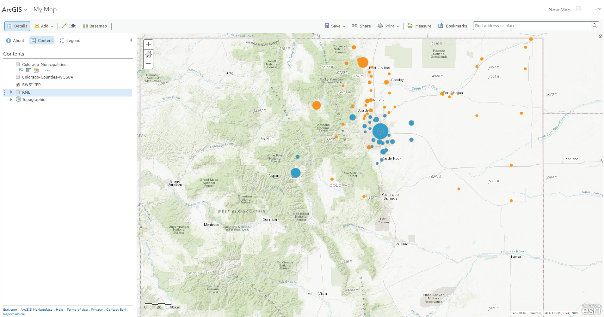

# Create a Basic Map / Change the Style #

Let's return to our layer of IPP point data for the South Platte and Metro basins, which looks like the following:

  

We'll now change the color and size of the points to reflect a couple of the attributes associated with each IPP 
project.

1.  Click on the Change Style button within the SWSI IPPs layer:
  
2.  Under "Choose an attribute to show", select IBCC_Basin; under "Select a drawing style", click on OPTIONS for 
"Types (Unique Symbols)":

  
Leave the color for the Metro Basin as blue.  We'll change the color for the South Platte Basin.  
3.  Click on the red circle representing South Platte Basin IPP projects and choose an orange color for both the 
fill and the outline:

  
The IPP layer should now look like the following:

  
4.  Click OK.  Now let's change the size of the points based on the amount of water the project is expected to 
deliver, in acre-feet.  
5.  Under "Choose an attribute to show", click on "Add attribute".  Choose "Yield".

  
6.  Click "Done".  The map should look similar to the following:

  
We have now symbolized IPP projects based on IBCC basin in which they are located and how much water the project 
is predicted to deliver.

------------------
## Next Steps ##

The next step is to configure the pop-ups in the map.
