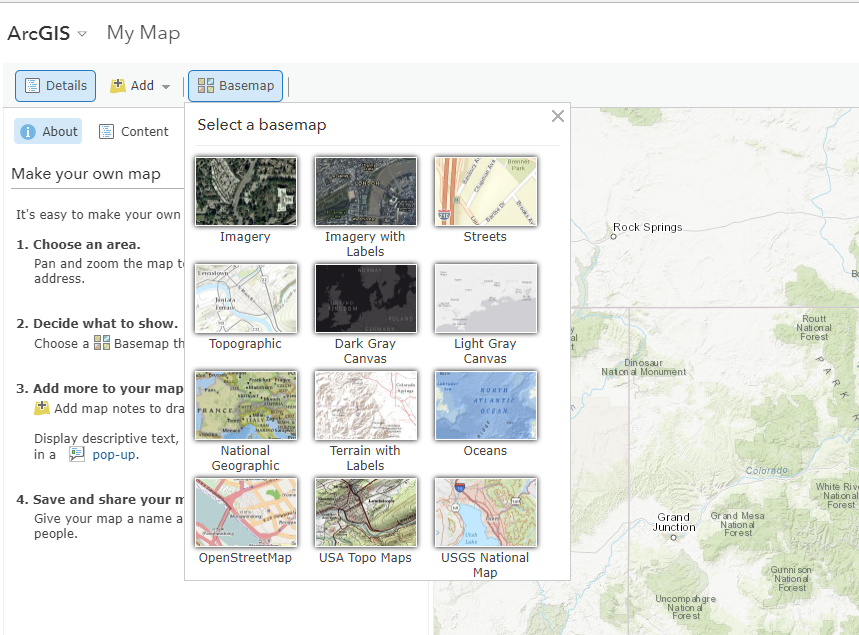

# Create a Basic Map / Choose a Basemap #

A basemap provides a background of geographical context for the content you want to display in a map.  Think of 
a basemap as the background for your map that shows county boundaries, cities, rivers, etc.  There are a few ways 
to choose a basemap.

* **Select basemap from the gallery** - ArcGIS's basemap gallery includes a variety of choices, including topography, 
imagery and streets.

* **Use your own basemap** - search for an existing layer or add a layer from the web.  You can use basemaps from 
ArcGIS Server layers, OGC layers and tile layers.

* **Create a multilayer basemap** - you can create a basemap using operational layers in your map.  These are the 
layers that you interact with and that draw on top of the basemap.  This is useful when you have two or more layers 
that you want to use together as a background, or context, for your map.  The following types of layers can be 
included in a multilayer basemap:
	* Imagery
	* Map image
	* Tile
	* Vector tile
	* WMS OGC
	* WMTS OGC
	* Bing
	* OpenStreetMap
 
------------------
## Select a Basemap from the Gallery ##

Let's choose a basemap from the basemap gallery.  In Map Viewer, click on Basemap and choose Topographic:

------------------
## Use a Basemap from the Web ##

Needs to be completed.

------------------
## Create a Multilayer Basemap ##

OWF is not investigating this option at this time.

------------------
## Next Steps ##

The next step is to add data layers to the basemap.  We will use the Topographic basemap that is available 
from the basemap gallery in our example.
