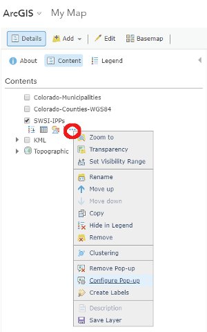
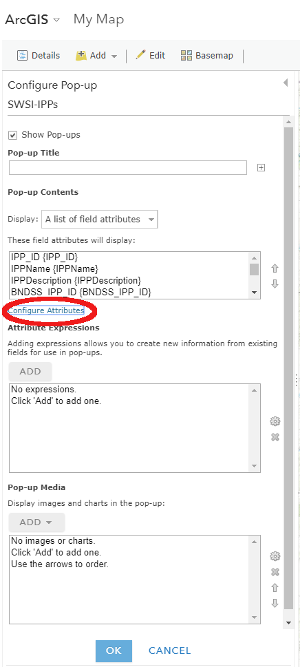
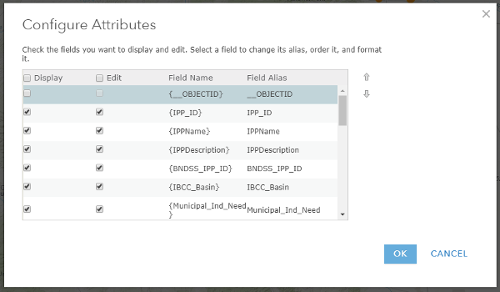
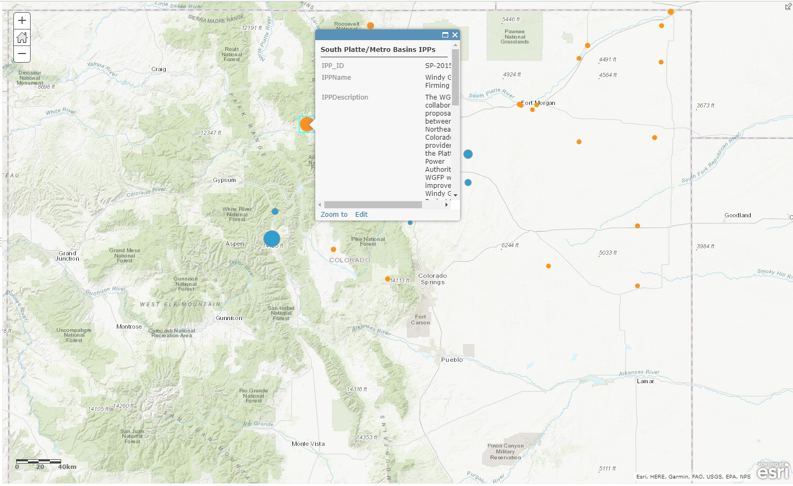

# Create a Basic Map / Configure Pop-ups #

Pop-ups reveal the attributes associated with each feature within a layer.  Pop-ups can be configured 
to reveal only particular attributes of interest found within the layer's attribute table.  They can 
also show attachments, images and charts and can link to external web pages.

We will configure pop-ups on the SWSI IPP layer so that some information about each project is shown, 
but without bogging down the pop-up with too many attributes.

1.  Click on the More Options button (...) and select "Configure Pop-up":

  
2.  Click on "Configure Attributes": 

  
The list of attributes associated with the layer is visible:

  
3.  Click the check marks in the "Display" column to choose which attributes you want to display in the 
pop-up.  
4.  When finished, click on any point on the map and you will see a pop-up for that point, similar to the 
following:

   
Note that you may need to scroll within the pop-up to see all of the information.  OWF has not yet found 
a way to change the size of the pop-up window.

There are many other features of pop-ups that can be configured, such as adding images, charts and 
attachments.  These options may be discussed in a future version of this documentation.

------------------
## Next Steps ##

The next step is to save the map so that it can be used in a Story Map.
