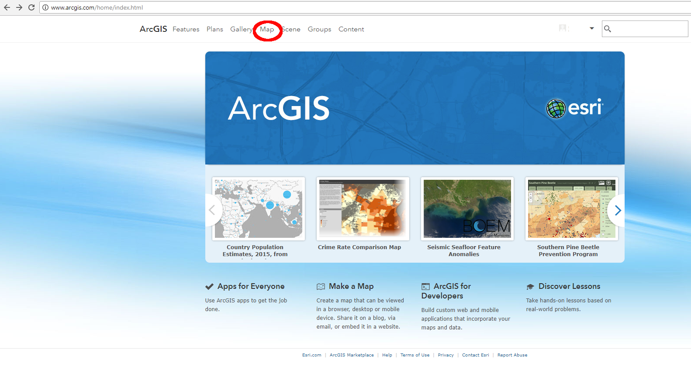

# Create a Basic Map / Overview #

You can use any ArcGIS Online web map in a Story Map.  You can use web maps that have been created and shared publicly by 
other users, your own existing web map or you can create a new map as you are building a Story Map.  It is unlikely that 
you would be building a Story Map solely based on someone else's map, so the first step is to make your own map.  This
is the focus of this section. 

A [tutorial](http://doc.arcgis.com/en/arcgis-online/get-started/get-started-with-maps.htm) is available for making maps 
and those steps will be described here with specific examples.

------------------

## Sign In to ArcGIS Online ##

To begin, sign into ArcGIS Online:

------------------

## Start a New Map ##

After signing in, navigate to "Map" at the top of the page:

You will then see the following screen.  This is called Map Viewer.

------------------

## Next Steps ##

The remaining sections will describe how to create a basic map by choosing a basemap, adding layers, changing the map style,
 configuring popups and saving the map.

