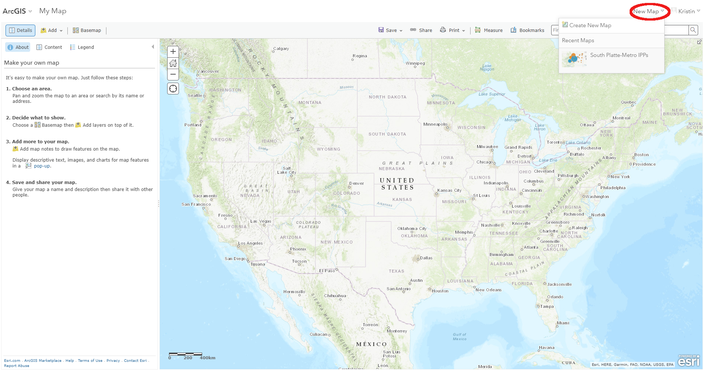

# Create a Basic Map / Save the Map #

1.  Click the "Save" button at the top-center of the map.
2.  Choose a name for the map and provide tags and a description of the map:

  
There are a couple of ways to view this map again when you've signed out of 
ArcGIS Online.

1.  Log in to ArcGIS Online.  
2.  From the options at the top of the page, click "Content":

  
3.  Click on the "My Content" tab.  The "SWSI IPPs" map should be listed:

  

A second way to access the map is to do the following:

1.  Log in to ArcGIS Online.
2.  From the options at the top of the page, click "Map":

  
You will then be directed to Map Viewer.  
3.  Click the drop-down arrow next to "New Map".  You should see the 
South Platte-Metro IPPs map listed:

  

------------------
## Next Steps ##

The next step is to learn more about Story Map templates.

 
