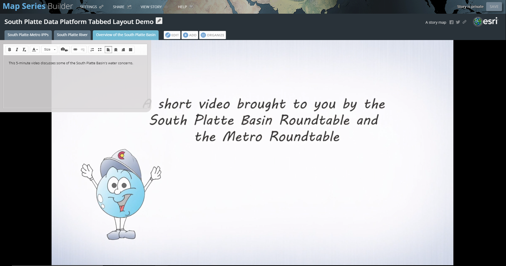

# Create a Story Map / Tabbed Layout Example #

To create a Story Map in the Tabbed Layout, first navigate to the Story Maps 
[homepage](https://storymaps.arcgis.com/en/app-list/).  Each Story Map template 
contains an option to "Build":

  

We will use the Builder to create the Story Map.

## Add a Map ##
1.  Create a name for the Story Map.  OWF is using "South Platte Data Platform 
Tabbed Layout Demo" in this example.
2.  Add the first tab of the Story Map:

  
Note that we can add a map, image, video, or another web page's content.  Let's 
add the South Platte-Metro IPP map that we created in previous steps.  
3.  Make sure "CONTENT:" is selected as Map, then click on "Select or create a map".  
Choose "Select a map".  You will automatically be directed to your "My Content" 
folder, where currently the only option to select is the South Platte-Metro IPP map:

  
Leave all of the default settings as-is, and click "ADD".  The tab looks similar to 
the following:

    
The title of the tab is the same as the map's name.  This can be changed by clicking 
on the "EDIT" tab next to the tab's name.  You can also change the map's location 
to be locked to a specific location so that the reader does not have to immediately 
zoom into the map.  Under "Extras", select the Legend box to display the legend.  
4.  Add text to the tab to describe its contents:

  
We now have our first tab.  To save the Story Map at any time, click on "SAVE" in the 
upper right corner of the page. 

-----------------
## Add an Image ##
1.  Add a second tab by clicking on the "ADD" tab next to the "EDIT" tab.  We will add 
a photo to the Story Map.  
2.  Make sure "CONTENT:" is selected as "Image".  You can choose to upload an image from 
your computer, add images from Flickr or Google+ or link to an image via a URL.  OWF found 
an [image](http://www.photos-public-domain.com/wp-content/uploads/2014/08/south-platte-bike-path-through-denver.jpg) 
of the South Platte River and a bike path next to it in Denver.  Let's add this image 
via its URL.  **Note that many images may be copyright protected.**  Don't forget to add a 
name for the tab and some text describing the image. 

  
 
  

-----------------
## Add a Video ##
For our third tab, we will add a video to the Story Map.  The 
[South Platte Basin's website](http://southplattebasin.com/) contains a short [video](https://vimeo.com/114841419) that 
describes the South Platte Basin.  We will add in this video.

1. Click on the "ADD" tab.  Select "Video" from the "CONTENT:" options.  You will see the 
following image:

  
We need to follow the instructions that are listed and instead add the video as a web page.  
2.  Navigate to the video's [URL](https://vimeo.com/114841419).  Click on "Share":

  
3.  Copy the Embed code and then paste into the "Embed code" window:
 
  
  
You will receive an error that states that the embed code can only contain one iframe. 
You will need to remove some of the code so that only the following is shown: 
``<iframe src="https://player.vimeo.com/video/114841419?title=0&byline=0&portrait=0" width="640" height="360" frameborder="0" webkitallowfullscreen mozallowfullscreen allowfullscreen></iframe>``  
4.  Click "Configure".  Keep the option to fill the screen.  Click "SAVE".  The third 
tab should now contain the video.  Add some text to describe the video.

  

-----------------
## Add Interactive Content from a Web Page ##
For our fourth tab, let's add some content from another web page.  In particular, 
we will focus on content that is an interactive graphic or visualization, since 
interactive graphics allow a reader to dive even deeper into a story.

For this tab, we will add a visualization developed by OWF.  This visualization illustrates 
changes in irrigated acreage in the South Platte Basin using data from the South Platte 
Decision Support System (SPDSS).  Changes in the amount of agriculture, the method of irrigation 
and the source of water are highlighted.  The intent of the visualization is to 
dynamically visualize three separate variables over time.  This is an example of a 
[motion chart](https://en.wikipedia.org/wiki/Motion_chart); it is also a version of a 
[Gapminder tool](https://www.gapminder.org/tools/#_data_/_lastModified:1521573755643;&chart-type=bubbles).

**But first, a word about http vs. https.**  Story Maps are accessed over an encrypted connection (https). 
In order to add web content to a Story Map, the content must also have an encrypted address, rather than 
an unencrypted address (http).  If you have an ArcGIS Organizational Account, then you can change whether 
content can be http or https.  However, if you only have a public account, then you cannot change this 
setting.  If you attempt to add in a web page with an http address, the content will not load.  Esri 
recommends that you only use web content with https for web security reasons.  Esri further 
[recommends](https://blogs.esri.com/esri/arcgis/2016/04/14/embedding-apps-and-websites-in-story-maps/) 
this alternative:  add a screen shot of the content you wish to add and then provide a hyperlink to the web 
page in the text.  We will use this alternative to load the irrigated acreage visualization.

1.  Click on the "ADD" tab.  Select "Image" from the "CONTENT:" options.  OWF took a screen shot of the
[visualization](http://viz.openwaterfoundation.org/co/owf-viz-co-spdss-ag-gapminder/) and saved the image 
in PNG format.  The file is selected using the Upload option.  Select the position to "Fit".  Click "SAVE". 
The new tab looks like the following:

  
2.  Add in text about how the visualization works and provide a link to it:

  

As a further illustration, let's add in information about the South Platte's Basin Implementation Plan. 
This will allow us to directly access a web page within the Story Map.  
3.  Click on the "ADD" tab.  Select "Web page" from the "CONTENT:" options.  Insert the 
[link](https://www.colorado.gov/pacific/sites/default/files/SouthPlatteBasinImplementationPlan-04172015.pdf) 
to the South Platte's Basin Implementation Plan URL in the "Web page link" window.  Configure the page to 
fill the screen.  Click "ADD":

  
You can scroll through the document as if you were accessing it from a separate web page.
  
**Note that not all websites, even https addresses, will load.  For example, OWF attempted to load the 
address for South Platte Basin information from the Colorado Water Plan's website 
(https://www.colorado.gov/pacific/cowaterplan/south-platte-river-basin) and the page would not load.  At 
this time OWF has not determined why some pages load and others do not.** 

-----------------
## Save and Share the Story Map ##
Before the Story Map is shared and given its own URL address, we can first view how it will look as a 
finished product and make additional edits, if necessary.

1.  At the top of the Story Map page, click "VIEW STORY":

  
A new tab opens that shows how the Story Map will look to the public.  Most of the tabs look good.  The 
one exception is the Agriculture in the South Platte Basin tab.  Here, the text is covering up some of the 
image.  We can go back to the editable version of the Story Map and change the positioning of the image.  
2.  Click on the Agriculture in the South Platte Basin tab.  Then click "EDIT".  Change the Position to 
Center.  The tab should now look like the following:

  
3.  Save the story and then click "VIEW STORY".  Now the text does not hide the image.  
4.  Now we can share the Story Map, which will make it public and give the story its own URL.  Click on 
"SHARE":

    
5.  You will then see the screen below.  Click "Public":

    
The Story Map now has its own URL address.  Click "CLOSE".

Another way to find the Story Map's address is to navigate to the Content page of your account.  Once there, 
click on the Story Map, then click on View Application:

  
The Story Map opens in a new tab, where you can view its URL address.

This example Tabbed Layout Story Map can be viewed [here](https://www.arcgis.com/apps/MapSeries/index.html?appid=5664b970f6154193a1dab3b5d4f27336).

------------------
## Next Steps ##
We have now created a basic Story Map using the Tabbed Layout template.  Next we will make the same story 
using the Side Accordion template.

