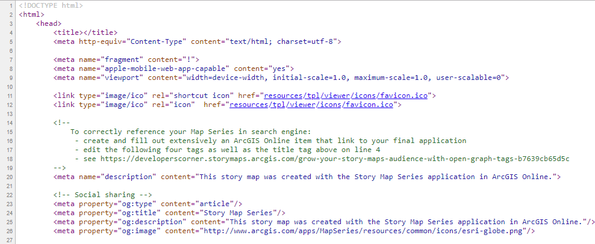

# Learn ArcGIS Story Maps / Hosting a Customized Story Map #
In this hosting scenario, you might want to customize the Story Map app further by adding a new feature. 
For example, you may want to add audio or data-driven text to your story.  Customization is the most 
extensive type of modification you can do to a Story Map app, and you'll need to be a JavaScript 
developer to be able to do this.

The following steps assume you have already built a Story Map on ArcGIS Online.

1.  Clone or download the source code for the app you used to build the story from 
[GitHub](https://github.com/Esri/storymap-series).  This is the same source code that was 
discussed in the previous section.  Note that you will clone the entire repository; other 
files that will be needed are included in the repository, not just the source code.  
2.  The code will be downloaded to your Downloads folder as a zip file with the 
following name:  ``storymap-series-master``.  Extract the zipped files and then open 
``index.html`` in the ``src`` folder with a text editor like Notepad++.  The page will 
look like the following:

  
3.  Scroll to line 40.  You should see the following text:  
``appid: "",``.  
4.  Insert the Story Map ID between the quotation marks:  
``appid: "5664b970f6154193a1dab3b5d4f27336",``.  
5.  Make customizations to the app.  
    a.  **Would be good to have an example here but OWF does not know how to do this yet.**  
6.  Save the ``index.html`` file and close it.  
7.  Build a compiled version of the app (as described in the app's ``readme`` file).  This 
must be done to have a deployable version of the customized Story Map.  
8.  Deploy the compiled version of ``index.html`` to your web server.  

You can run the app from your local machine from the source code while developing your customized Story 
Map, but you should never deploy the source code to a production web server for the following reasons:

* Your Story Map will take longer to load and run slower since the code isn't minified or optimized

* Readers may see an *Edit* button when viewing the Story Map that would let them open it in Builder 
(they would not be able to save changes though)

* Your custom code will be exposed since the JavaScript isn't obfuscated

------------------
## Next Steps ##
The next section contains frequently asked questions and their answers about hosting and editing 
Story Maps.