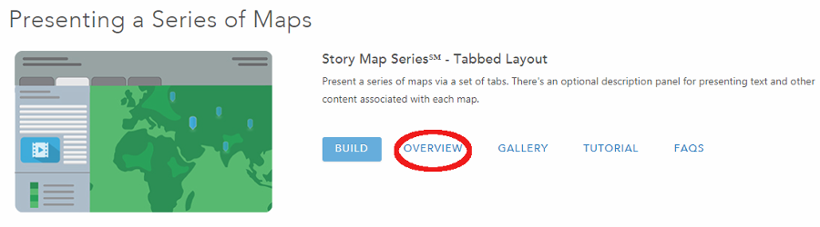
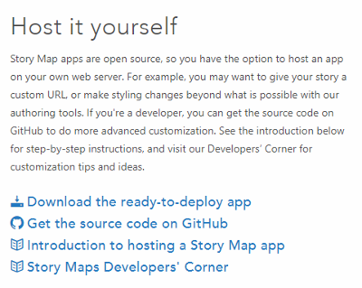
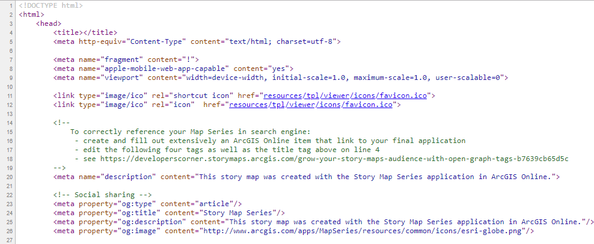

# Learn ArcGIS Story Maps / Hosting a Styled Story Map #
In this hosting scenario, you might want to make some style changes to your Story Map that alter the 
colors, layout or appearance of the app that could not be done in the builder.  You will only need 
to modify the app's CSS; you can do this by using ``<style>`` tags in the ``index.html`` file.

The following steps assume you have already built a Story Map on ArcGIS Online.

1.  Download the compiled code for the app you used to build the story.  
    a.  Navigate to the [Story Maps Apps](https://storymaps.arcgis.com/en/app-list/) page.  
	b.  Find the app you used to build the story.  In this example, we used the Tabbed Layout app. 
Click on Overview:

  
    c.  Navigate to the "Host it yourself" section at the bottom of the page.  Click "Download the 
	ready-to-deploy app":  

  
This is the compiled code that was discussed in the previous section.  
    d.  The code will be downloaded to your Downloads folder as a zip file with the following name:  
``storymap-series-1.10.1``.   
2.  Extract the zipped files and then open ``index.html`` with a text editor like Notepad++.  The 
page will look like the following:

  
3.  Scroll to line 40.  You should see the following text:  
``appid: "",``  
4.  Insert the Story Map ID between the quotation marks:  
``appid: "5664b970f6154193a1dab3b5d4f27336",``.  
5.  Make changes to the app's appearance by adding ``<style>`` tags to the file.  
    a.  **Need an example here.**  
6.  Save the ``index.html`` file and close it.  
7.  Deploy ``index.html`` to your web server.  

------------------
If you do not currently have a web server in which to deploy the app, you can follow these steps to 
setup a local host server to view how the Story Map will look.  This assumes the user is using Google 
Chrome as their web browser.

1.  Open a new tab in Chrome and select "Apps" in the upper lefthand corner of the screen.  
2.  Select "Web Store" and search for an app titled "Web Server for Chrome".  It should have a yellow 
circle icon that says "200 OK!". Download the app.  
3.  Open a new tab, click on "Apps" and the Web Server app should appear.  Click on the app.  
4.  Click on the "CHOOSE FOLDER" button. Navigate to the folder that contains the ``index.html`` file.  
5.  Click on the available Web Server URL (http://127.0.0.1:8887).  
6.  A new web page will open with the title "Index of current directory..." Click on ``index.html``. 
The Story Map should now be visible.

------------------
**Perhaps need some discussion here about what to do next.  Take the compiled code folder that was downloaded and put it into a GitHub repository??**

------------------
## Next Steps ##
The next step is to host our previously created Story Map on our own server after further customizing 
the Story Map by adding a new feature.