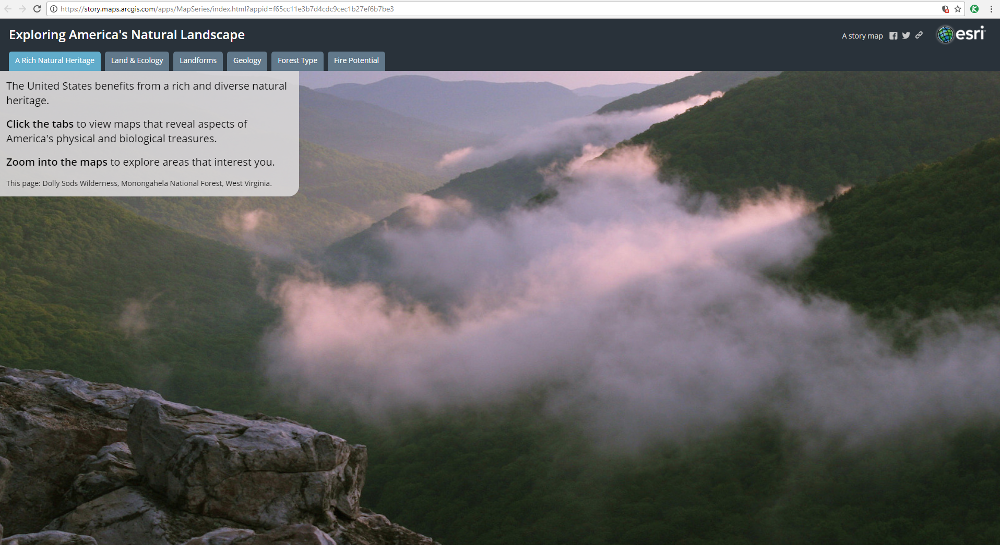
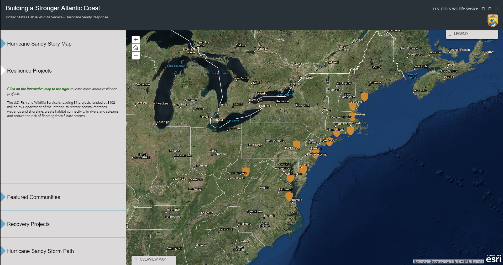
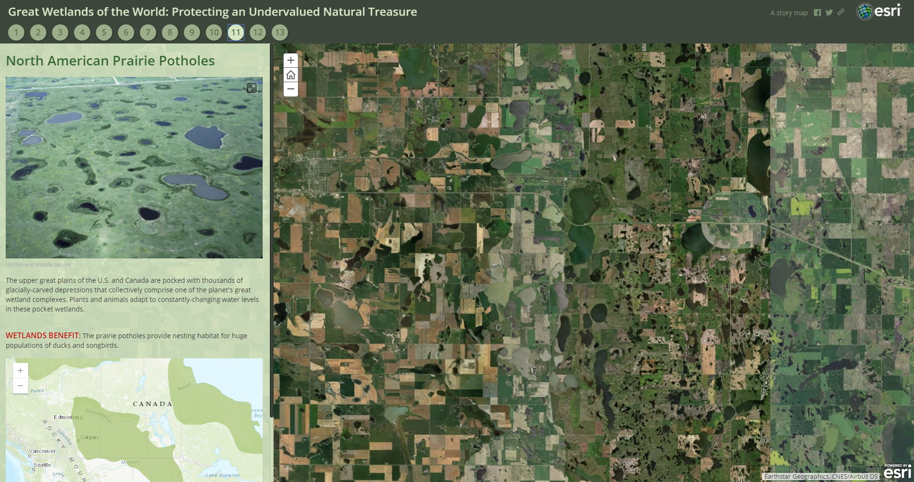

# Story Map Templates #
A Story Map is created via one of several app [templates](https://storymaps.arcgis.com/en/app-list/).  The
four templates that appear to be most useful for the kind of work that OWF does are the Story Map Series 
templates: tabbed layout, side accordion layout and bulleted layout, as well as the Story Map Cascade template. 
These are described below.

## Story Map Series - Tabbed Layout ##
The tabbed layout presents a series of maps via a set of tabs.  An optional description panel for presenting 
text and other content is provided.  Along with maps, images, videos and web pages can be added.  An example 
Story Map is shown below in which the first tab of the story is visible.  This Story Map can also be viewed 
[here](https://story.maps.arcgis.com/apps/MapSeries/index.html?appid=f65cc11e3b7d4cdc9cec1b27ef6b7be3).

We will create a Story Map in tabbed layout in a subsequent section.

------------------
## Story Map Series - Side Accordion Layout ##
The side accordion layout presents a series of maps, and accompanying text and other content for each map, in 
an expandable panel.  Clicking a title selects the map and expands the panel to reveal the text.  An example 
Story Map is shown below in which the second panel is visible.  This Story Map can also be viewed 
[here](http://fws.maps.arcgis.com/apps/MapSeries/index.html?appid=7b655fd1e5ce460eaa1f9ff145ece4d8).

We will create a Story Map in side accordion layout in a subsequent section.

------------------
## Story Map Series - Bulleted Layout ##
The bulleted layout presents a series of maps (or images, videos and web pages) via numbered bullets, one map 
per bullet.  This is a good choice for when you have a large number of maps to present.  An optional description 
panel for presenting text and other content associated with each map is available.  An example Story Map is shown 
below in which the eleventh bullet of the story is visible.  This Story Map can also be viewed 
[here](https://story.maps.arcgis.com/apps/MapSeries/index.html?appid=aed61922c4b444ba843d19e676e80004).

We will create a Story Map in bulleted layout in a subsequent section.

------------------
## Story Map Cascade ##
The Cascade template creates a story that contains a full-screen scrolling experience that blends narrative text, 
maps, 3D scenes, images, videos, etc.  Sections containing text and in-line media can be interspersed with "immersive" 
content that fills the screen, including map animations and transition effects.  An example Story Map can be viewed 
[here](https://cwcb.maps.arcgis.com/apps/Cascade/index.html?appid=b588bcb8451d4ae1bccabde5a05a8952).  We will 
create a Story Map Cascade in a subsequent section.

------------------
## Other Templates ##

Other Story Map templates that may be useful include the following:

* **Story Map Tour** - presents a set of photos or videos along with captions, linked to an interactive map.  Ideal for 
walking tours or any sequence of places you'd like users to follow in order.  See an 
[example](http://wgsg.maps.arcgis.com/apps/MapTour/index.html?appid=8d81698048ee4fb785637835100f44ed&webmap=e7b5b65b7cec4f7dafe8e88401d27961) 
about the water crisis in the Southwest.
* ** Story Map Journal** - creates an in-depth narrative organized into sections presented in a scrolling side panel.
As users scroll through the sections they see the content associated with each section, such as a map, 3D scene, image, 
video, etc.  See an [example](https://storymaps.esri.com/stories/2017/big-dams/) about big dams.
* **Story Map Crowdsource** - need to fill in.
* **Story Map Shortlist** - need to fill in.
* **Story Map Swipe** - need to fill in.
* **Story Map Spyglass** - need to fill in.
* **Story Map Basic** - need to fill in.

------------------
## Next Steps ##
The next step is to create a basic Story Map using the templates.
